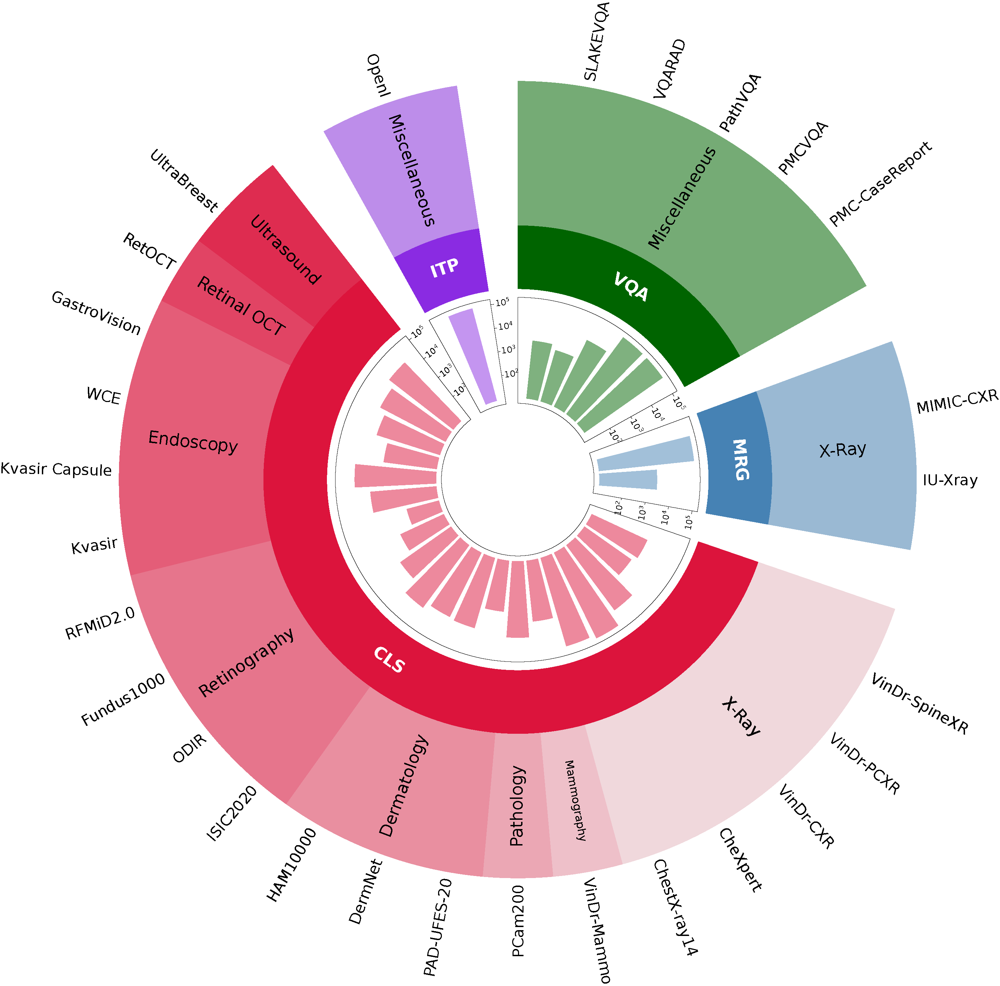
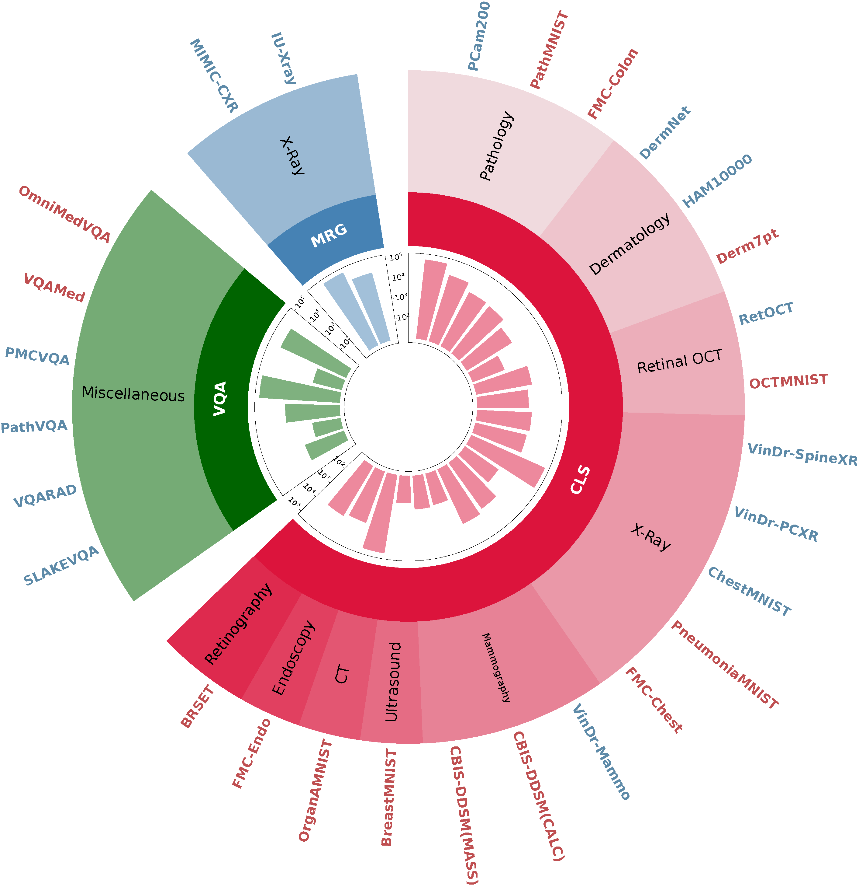

# Dataset Overview

This document provides an overview of the datasets used for training and benchmarking, including their availability and access information. The datasets are categorized into training datasets and benchmark datasets.

## Training Datasets

The following table summarizes the availability and access information for the training datasets:

| Dataset Name                 | Link                                                                                      | Access Type         |
| ---------------------------- | ----------------------------------------------------------------------------------------- | ------------------- |
| Visual Question Answering    |                                                                                           |                     |
| Slake-VQA                    | [Slake-VQA](https://www.med-vqa.com/slake/)                                               | Open Access         |
| VQA-RAD                      | [VQA-RAD](https://osf.io/89kps/)                                                          | Open Access         |
| Path-VQA                     | [Path-VQA](https://huggingface.co/datasets/flaviagiammarino/path-vqa)                     | Open Access         |
| PMC-VQA                      | [PMC-VQA](https://huggingface.co/datasets/xmcmic/PMC-VQA)                                 | Open Access         |
| PMC-CaseReport               | [PMC-CaseReport](https://huggingface.co/datasets/chaoyi-wu/PMC-CaseReport)                | Open Access         |
| Medical Report Generation    |                                                                                           |                     |
| MIMIC-CXR                    | [MIMIC-CXR](https://physionet.org/content/mimic-cxr/2.0.0/)                               | Credentialed Access |
| IU-Xray                      | [IU-Xray](https://www.kaggle.com/datasets/raddar/chest-xrays-indiana-university/data)     | Open Access         |
| Medical Image Classification |                                                                                           |                     |
| VinDr-SpineXR                | [VinDr-SpineXR](https://vindr.ai/datasets/spinexr)                                        | Credentialed Access |
| VinDr-PCXR                   | [VinDr-PCXR](https://physionet.org/content/vindr-pcxr)                                    | Credentialed Access |
| VinDr-Mammo                  | [VinDr-Mammo](https://vindr.ai/datasets/mammo)                                            | Credentialed Access |
| VinDr-CXR                    | [VinDr-CXR](https://vindr.ai/datasets/cxr)                                                | Credentialed Access |
| CheXpert                     | [CheXpert](https://stanfordmlgroup.github.io/competitions/chexpert/)                      | Restricted Access   |
| ChestX-ray14                 | [ChestX-ray14](https://nihcc.app.box.com/v/ChestXray-NIHCC)                               | Credentialed Access |
| PCam200                      | [PCam200](https://drive.google.com/drive/folders/1Oh7onawKsDW5ScamVO5ByXFgqdYJ39sK)       | Open Access         |
| PAD-UFES-20                  | [PAD-UFES-20](https://data.mendeley.com/datasets/zr7vgbcyr2/1)                            | Open Access         |
| DermNet                      | [DermNet](https://www.kaggle.com/datasets/shubhamgoel27/dermnet)                          | Open Access         |
| HAM10000                     | [HAM10000](https://www.kaggle.com/datasets/kmader/skin-cancer-mnist-ham10000)             | Open Access         |
| ISIC2020                     | [ISIC2020](https://challenge2020.isic-archive.com/)                                       | Open Access         |
| Kvasir                       | [Kvasir](https://datasets.simula.no/kvasir/)                                              | Open Access         |
| Kvasir Capsule               | [Kvasir Capsule](https://datasets.simula.no/kvasir-capsule/)                              | Open Access         |
| WCE                          | [WCE](https://www.kaggle.com/datasets/francismon/curated-colon-dataset-for-deep-learning) | Open Access         |
| GastroVision                 | [GastroVision](https://github.com/DebeshJha/GastroVision)                                 | Open Access         |
| ODIR                         | [ODIR](https://www.kaggle.com/datasets/andrewmvd/ocular-disease-recognition-odir5k)       | Open Access         |
| Fundus1000                   | [Fundus1000](https://www.kaggle.com/datasets/linchundan/fundusimage1000)                  | Open Access         |
| RFMiD2.0                     | [RFMiD2.0](https://zenodo.org/records/7505822)                                            | Open Access         |
| Retinal OCT-C8               | [Retinal OCT-C8](https://www.kaggle.com/datasets/obulisainaren/retinal-oct-c8)            | Open Access         |
| UltraBreast                  | Private                                                                                   | Private             |

The training datasets are distributed as follows:

## Benchmark Datasets

The following table summarizes the availability and access information for the benchmark datasets:

| Dataset Name                 | Link                                                                                             | Access Type         |
| ---------------------------- | ------------------------------------------------------------------------------------------------ | ------------------- |
| Visual Question Answering    |                                                                                                  |                     |
| Slake-VQA                    | [Slake-VQA](https://www.med-vqa.com/slake/)                                                      | Open Access         |
| VQA-RAD                      | [VQA-RAD](https://osf.io/89kps/)                                                                 | Open Access         |
| Path-VQA                     | [Path-VQA](https://huggingface.co/datasets/flaviagiammarino/path-vqa)                            | Open Access         |
| PMC-VQA                      | [PMC-VQA](https://huggingface.co/datasets/xmcmic/PMC-VQA)                                        | Open Access         |
| VQA-Med                      | [VQA-Med](https://github.com/abachaa/VQA-Med-2019)                                               | Open Access         |
| OmniMedVQA                   | [OmniMedVQA](https://openxlab.org.cn/datasets/GMAI/OmniMedVQA)                                   | Credentialed Access |
| Medical Report Generation    |                                                                                                  |                     |
| MIMIC-CXR                    | [MIMIC-CXR](https://physionet.org/content/mimic-cxr/2.0.0/)                                      | Credentialed Access |
| IU-Xray                      | [IU-Xray](https://www.kaggle.com/datasets/raddar/chest-xrays-indiana-university/data)            | Open Access         |
| Medical Image Classification |                                                                                                  |                     |
| PCam200                      | [PCam200](https://drive.google.com/drive/folders/1Oh7onawKsDW5ScamVO5ByXFgqdYJ39sK)              | Open Access         |
| DermNet                      | [DermNet](https://www.kaggle.com/datasets/shubhamgoel27/dermnet)                                 | Open Access         |
| HAM10000                     | [HAM10000](https://www.kaggle.com/datasets/kmader/skin-cancer-mnist-ham10000)                    | Open Access         |
| RetOCT                       | [RetOCT](https://www.kaggle.com/datasets/obulisainaren/retinal-oct-c8)                           | Open Access         |
| VinDr-SpineXR                | [VinDr-SpineXR](https://vindr.ai/datasets/spinexr)                                               | Credentialed Access |
| VinDr-PCXR                   | [VinDr-PCXR](https://physionet.org/content/vindr-pcxr/1.0.0/)                                    | Credentialed Access |
| VinDr-Mammo                  | [VinDr-Mammo](https://vindr.ai/datasets/mammo)                                                   | Credentialed Access |
| ChestMNIST                   | [ChestMNIST](https://medmnist.com/)                                                              | Open Access         |
| PneumoniaMNIST               | [PneumoniaMNIST](https://medmnist.com/)                                                          | Open Access         |
| BreastMNIST                  | [BreastMNIST](https://medmnist.com/)                                                             | Open Access         |
| OrganAMNIST                  | [OrganAMNIST](https://medmnist.com/)                                                             | Open Access         |
| PathMNIST                    | [PathMNIST](https://medmnist.com/)                                                               | Open Access         |
| OCTMNIST                     | [OCTMNIST](https://medmnist.com/)                                                                | Open Access         |
| CBIS-DDSM(MASS)              | [CBIS-DDSM(MASS)](https://www.kaggle.com/datasets/awsaf49/cbis-ddsm-breast-cancer-image-dataset) | Open Access         |
| CBIS-DDSM(CALC)              | [CBIS-DDSM(CALC)](https://www.kaggle.com/datasets/awsaf49/cbis-ddsm-breast-cancer-image-dataset) | Open Access         |
| FMC-Colon                    | [FMC-Colon](https://github.com/openmedlab/MedFM)                                                 | Credentialed Access |
| FMC-Endo                     | [FMC-Endo](https://github.com/openmedlab/MedFM)                                                  | Credentialed Access |
| FMC-Chest                    | [FMC-Chest](https://github.com/openmedlab/MedFM)                                                 | Credentialed Access |
| Derm7pt                      | [Derm7pt](https://derm.cs.sfu.ca/Welcome.html)                                                   | Credentialed Access |
| BRSET                        | [BRSET](https://physionet.org/content/brazilian-ophthalmological/1.0.0/)                         | Credentialed Access |

The benchmark datasets are distributed as follows:

## Access Types

- **Open Access**: Datasets are freely available to the public.
- **Credentialed Access**: Requires specific permissions.
- **Restricted Access**: Requires contacting the dataset providers for access permissions.
- **Private**: Not publicly accessible.
